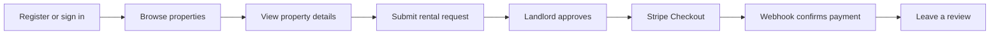

<div align="center">

# RentNest Frontend 🏠

### Find, request, list, and manage rental properties with ease.

[](https://nextjs.org/)
[](https://www.typescriptlang.org/)
[](https://ui.shadcn.com/)
[](https://stripe.com/)

**RentNest Frontend**

[Frontend Repository](https://github.com/Rezwanul777/rnest-frontend) · [Backend Repository](https://github.com/Rezwanul777/rent-nest-backend) · [Live Backend](https://rnest-backend.vercel.app) .[Live Frontend](https://rnest-frontend.vercel.app)

</div>

## About the project

RentNest is a responsive rental-property marketplace built with the Next.js App Router, TypeScript, shadcn/ui, and Tailwind CSS. It consumes the RentNest REST API and provides separate role-based experiences for tenants, landlords, and administrators.

- **Tenants** browse properties, submit rental requests, complete Stripe payments, and leave reviews.
- **Landlords** manage listings and approve or reject incoming rental requests.
- **Admins** manage users and moderate properties, requests, and payments.

All application records are loaded from the backend API; the core workflows do not depend on mock data.

## Live resources

| Resource            | URL                                                                                          |
| ------------------- | -------------------------------------------------------------------------------------------- |
| Frontend repository | [github.com/Rezwanul777/rnest-frontend](https://github.com/Rezwanul777/rnest-frontend)       |
| Backend repository  | [github.com/Rezwanul777/rent-nest-backend](https://github.com/Rezwanul777/rent-nest-backend) |
| Deployed backend Project    | [rnest-backend.vercel.app](https://https://rnest-frontend.vercel.app/)                                 |
| API base URL        | `https://rnest-backend.vercel.app/api`                                                       |
| API documentation   | [`API_INTEGRATION.md`](./API_INTEGRATION.md)                                                 |

## Demo admin account

> [!WARNING]
> These credentials are included only for assignment evaluation. Do not reuse this password for a personal or production account.

| Role  | Email                 | Password         |
| ----- | --------------------- | ---------------- |
| Admin | `ayaan.bin@gmail.com` | `admin-nest@123` |

## Core features

### Public

- Responsive homepage and property grid
- Backend-powered search, filters, sorting, and pagination
- Property details with optimized images and landlord information
- Dark and light themes
- Skeleton loaders, empty states, and route error boundaries
- Session-aware navigation for authenticated users

### Tenant

- Role-aware registration and login
- Validated rental-request form
- Request history with consistent status badges
- Stripe Checkout after landlord approval
- Payment success and cancellation pages
- Webhook-confirmed payment history
- Review form after successful payment

### Landlord

- Property and earnings overview
- Create, edit, delete, publish, and hide listings
- Image URL and amenities fields
- Approve or reject rental requests
- Optimistic UI updates with toast feedback
- Tenant and rental-agreement history

### Admin

- Platform statistics overview
- Searchable and paginated user management
- Ban and unban actions with self-ban protection
- Property moderation, including unavailable listings
- Platform-wide request and payment oversight

## Main workflow



### Rental lifecycle

```text
PENDING request
      ↓ Landlord approves
APPROVED request
      ↓ Tenant completes Stripe Checkout
PAID payment + ACTIVE agreement
      ↓ Review becomes available
VERIFIED REVIEW
```

Stripe webhook verification is the source of truth for a successful payment. Returning to the success URL alone does not mark a payment as paid.

## Technology stack

| Area          | Technology                  |
| ------------- | --------------------------- |
| Framework     | Next.js 16 App Router       |
| Language      | TypeScript                  |
| UI            | shadcn/ui with Nova styling |
| Styling       | Tailwind CSS 4              |
| Forms         | React Hook Form             |
| Validation    | Zod                         |
| Notifications | Sonner                      |
| Theme         | next-themes                 |
| Payments      | Stripe Checkout             |
| Deployment    | Vercel                      |

## Important routes

| Route                            | Access   | Purpose                                     |
| -------------------------------- | -------- | ------------------------------------------- |
| `/`                              | Public   | Homepage and featured properties            |
| `/properties`                    | Public   | Browse, filter, sort, and paginate listings |
| `/properties/[id]`               | Public   | Property details and rental-request CTA     |
| `/auth/register`                 | Guest    | Tenant or landlord registration             |
| `/auth/login`                    | Guest    | Role-aware login                            |
| `/dashboard/tenant`              | Tenant   | Tenant overview and request history         |
| `/dashboard/tenant/payments`     | Tenant   | Stripe payment history                      |
| `/dashboard/tenant/reviews`      | Tenant   | Waiting and submitted reviews               |
| `/dashboard/landlord`            | Landlord | Landlord overview                           |
| `/dashboard/landlord/properties` | Landlord | Property management                         |
| `/dashboard/landlord/requests`   | Landlord | Approve or reject rental requests           |
| `/dashboard/admin`               | Admin    | Platform overview                           |
| `/dashboard/admin/users`         | Admin    | User management                             |
| `/dashboard/admin/properties`    | Admin    | Property moderation                         |
| `/dashboard/admin/requests`      | Admin    | Request oversight                           |
| `/dashboard/admin/payments`      | Admin    | Payment oversight                           |
| `/payment/success`               | Tenant   | Stripe success feedback and review flow     |
| `/payment/cancel`                | Tenant   | Payment cancellation feedback               |

## Project structure

```text
rnest-frontend/
├── app/
│   ├── api/                    # Same-origin proxy route handlers
│   ├── auth/                   # Login and registration pages
│   ├── dashboard/
│   │   ├── tenant/
│   │   ├── landlord/
│   │   └── admin/
│   ├── payment/                # Stripe success and cancel pages
│   ├── properties/             # Property catalog and details
│   ├── error.tsx
│   ├── loading.tsx
│   └── page.tsx
├── components/
│   ├── auth/
│   ├── dashboard/
│   ├── home/
│   ├── layout/
│   ├── payment/
│   ├── properties/
│   └── ui/                     # shadcn/ui components
├── lib/                        # Environment, roles, cookies, validation
├── services/                   # Backend API service modules
├── types/                      # Shared TypeScript types
├── proxy.ts                    # Role-based route protection
└── API_INTEGRATION.md          # Frontend-to-backend endpoint map
```

## Getting started

### Prerequisites

- Node.js 20.9 or newer
- npm
- A running RentNest backend or the deployed API

### 1. Clone the repository

```bash
git clone https://github.com/Rezwanul777/rnest-frontend.git
cd rnest-frontend
```

### 2. Install dependencies

```bash
npm install
```

### 3. Configure the environment

Create a `.env.local` file in the project root:

```env
NEXT_PUBLIC_API_URL=https://rnest-backend.vercel.app/api
```

> Keep `STRIPE_SECRET_KEY`, `STRIPE_WEBHOOK_SECRET`, database credentials, and JWT secrets in the backend only.

### 4. Start development

```bash
npm run dev
```

Open [http://localhost:3000](http://localhost:3000).

### 5. Run quality checks

```bash
npm run typecheck
npm run lint
npm run build
```

## Available scripts

| Command             | Purpose                                   |
| ------------------- | ----------------------------------------- |
| `npm run dev`       | Start the development server with Webpack |
| `npm run typecheck` | Check TypeScript without emitting files   |
| `npm run lint`      | Run ESLint                                |
| `npm run build`     | Create a production build                 |
| `npm run start`     | Start the production build                |

## API error handling

- React Hook Form and Zod provide field-level validation.
- Backend validation errors are mapped to their matching fields.
- Sonner toasts report mutation success and failure.
- Optimistic actions roll back when the API rejects an update.
- `loading.tsx`, `error.tsx`, and `not-found.tsx` provide route-level feedback.


## Recommended next features

1. **Notification center** — notify users about request decisions, payment confirmation, and review availability.
2. **Saved properties** — allow tenants to favorite listings and save searches.
3. **Managed image uploads** — replace manual URLs with Cloudinary or UploadThing.
4. **Automated tests** — cover authentication, role protection, rental requests, Stripe Checkout, and moderation with Playwright.

## Before final submission

- Deploy the frontend and add its live URL above.
- Set `NEXT_PUBLIC_API_URL` in Vercel.
- Confirm backend CORS accepts the frontend deployment origin.
- Confirm the production Stripe webhook endpoint and signing secret.
- Test all three roles in separate browser sessions.
- Verify the demo admin credentials.
- Add two to four current screenshots or a short demo GIF.
- Run type checking, linting, and the production build.

## Security notes

- Access tokens are stored in HttpOnly cookies.
- Frontend role checks never replace backend authorization.
- Payment state is never trusted from URL parameters or client state.
- Stripe and database secrets belong only in the backend environment.

---

<div align="center">

Built this APP with Next.js, TypeScript, shadcn/ui, and the RentNest API.

</div>
